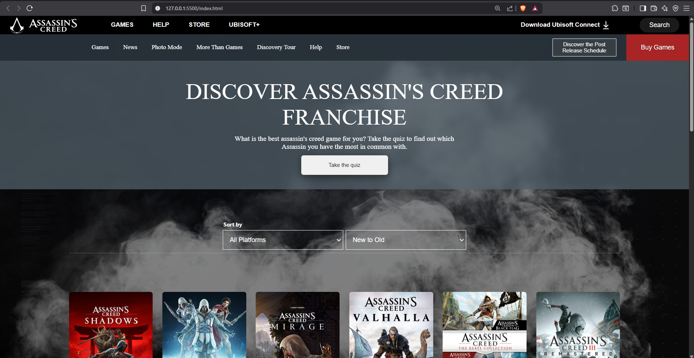
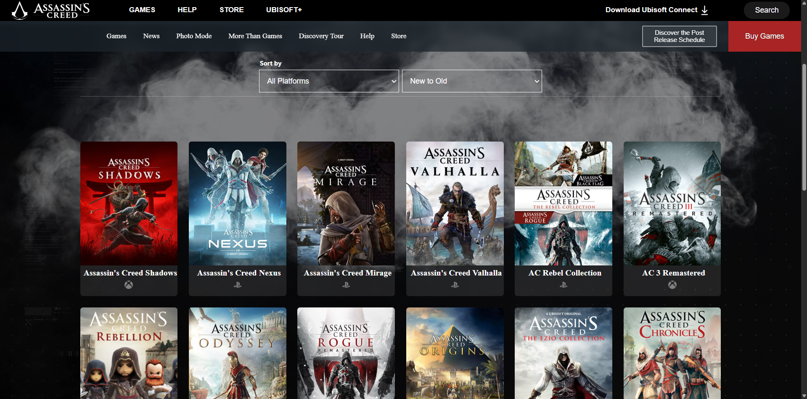
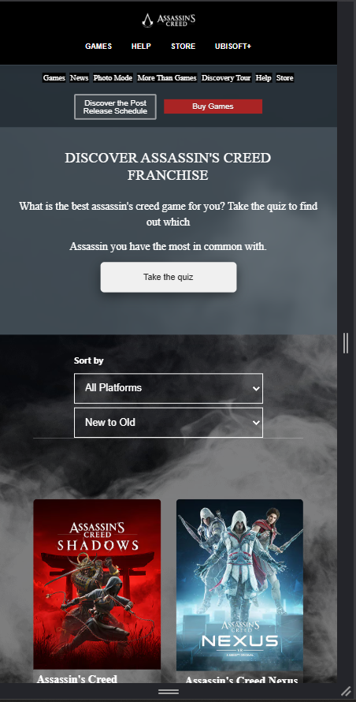
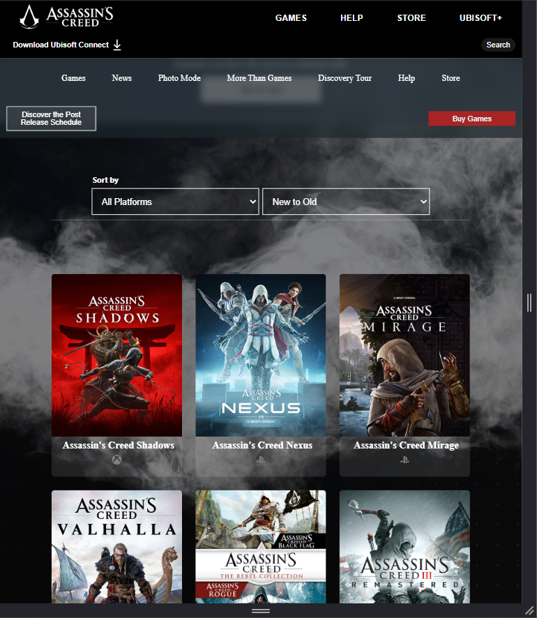

Unity Website Frontend Clone
Live Link-> https://aryensiwach.github.io/Unity-Clone/

This project is a frontend recreation of the official Unity website using only HTML and CSS.
The goal of the project was to practice layout structuring, responsive design, and modern UI styling without any external frameworks.

Features

Custom navigation bar with hover animations

Fullscreen hero background with layered effects

Cloud overlay and transparent blur section

Responsive footer and section layouts

Clean CSS architecture for easy modification

Tech Used

HTML5

CSS3

Grid and Flexbox

Media queries for responsiveness

Project Structure

index.html — Main page structure

style.css — All styling, layout, and animations

preview1.png

preview2.png

preview3.png

preview4.png

Preview

How to Run

Simply open index.html in your browser.
No frameworks or build tools are required.

